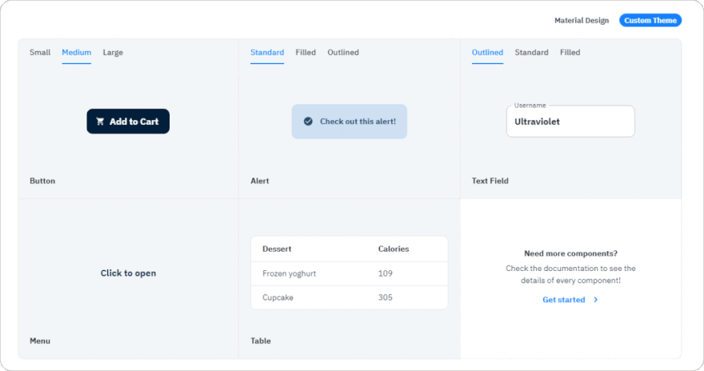
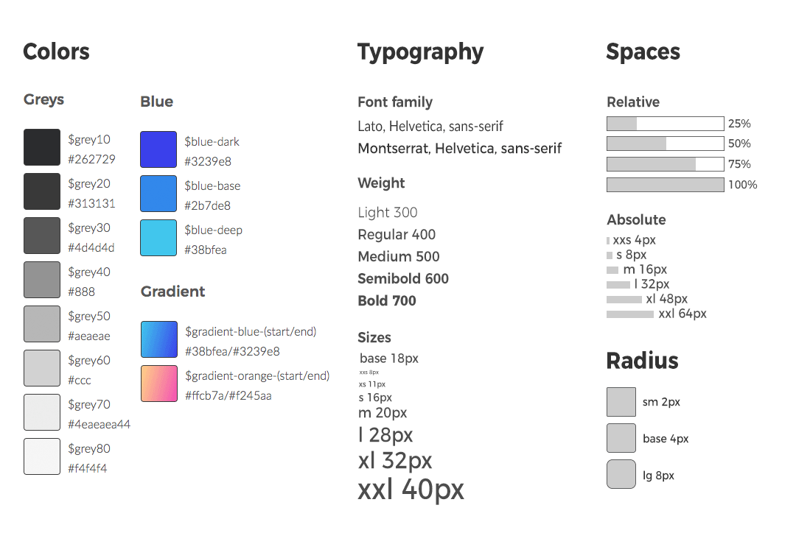
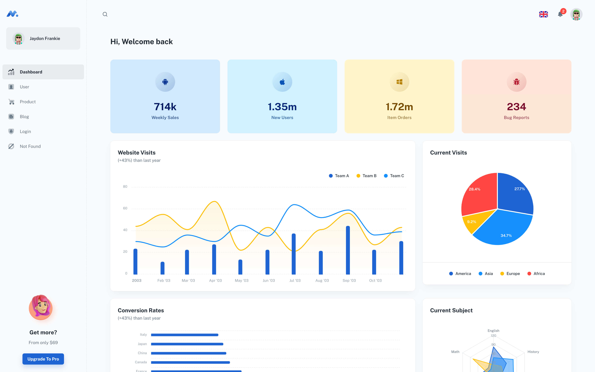
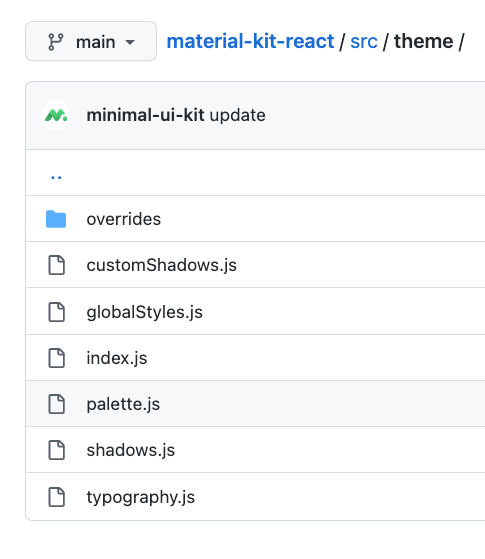

# How to use component library MUI

MUI stand for **M**aterial **UI**

- **What**: react library component implement base on `Google’s Material Design`
- **Why**: It provides a wide range of pre-built, customizable components: MUI includes a variety of components such as `buttons, forms, tables, and navigation bars`, which you can use to build your app quickly and easily.
- **Who**: BE or FE. `Don’t want to build from scratch. Focus to prototype and logic`.

<!--truncate-->

- Table of content

## Installation

```bash
yarn add @mui/material @emotion/react @emotion/styled
```

`@mui/material` library component material ui

`@emotion/react`, `@emotion/styled` are used default for style engine

## How to customize component `Button`


### 1. Use UI Props

```tsx
<Button variant="text">Text</Button>
<Button variant="contained">Contained</Button>
<Button variant="outlined">Outlined</Button>
```

Customize by passing props to component Button.

- `variant` : variant of button to use (`contained` , `outlined`, `text`)
- `color` : color of button (`primary`, `secondary` , `success` , …)
- `size` : size of button (`small` , `medium` , `large` )

:::info

Explore all available props on [MUI Button Props](https://mui.com/material-ui/api/button/#props)

:::

Pros:

- Easy to use and customize
- Consistency style
- No need to remember all props and value (Typescript)

Cons:

- Limit options
- Default Material Design

### 2. Use className Prop

If you want to override a component's styles using custom classes, you can use the `className` prop, available on each component.

```css
.primary-button {
  background-color: #000;
}

/* Increase the specificity */
.MuiButton-root.primary-button {
  color: #fff;
  background-color: #2065d1;
}
```

```tsx
<Button className="primary-button">Primary Button</Button>
```

Pros:

- Extend customize component by CSS property
- `No run time cost`
- Just CSS, no learning curve

Cons:

- `Hard to remember class`
- Need to `write specific selector to override` selector of component. Even use `!important` to apply style (Learn more how to [CSS injection order](https://mui.com/material-ui/guides/interoperability/#css-injection-order))
- It this style already exist class? 😑 `or` Okay write new class name 🤣

### 3. Use Sx Prop

The `[sx` prop](https://mui.com/system/getting-started/the-sx-prop/) is the best option for adding style overrides to a single instance of a component in most cases. It can be used with all Material UI components.

```tsx
<Button
  sx={{
    bgcolor: "#000",
    mr: 2,
    mb: 1,
    "&:hover": { bgcolor: "#000" },
  }}
>
  Primary Button
</Button>
```

Pros:

- Less boilerplate code, easy to style, just like `style` props to style inline
- Shorthand CSS property `mr` ⇒ `margin-right`
- Access theme value `primary.main` ⇒ `theme.palete.primary.main`
- No need to switch context component and style
- No need to name

Cons:

- If you duplicate or so much style, your code will messy quickly
- No centralize ⇒ when design change, we need to find by and by `sx`
- It is not the best option for extending component styling for reuse

:::tip
🧑‍💻 Only use `sx` for one-off customize
:::

- Show code painful 😂
  ```tsx
  <Button sx={{
  		bgcolor: '#000', mr: 2, mb: 1,
  		'&:hover': { bgcolor: '#000'}
  }}>
  	Primary Button
  </Button>
  <Button sx={{
  		bgcolor: '#0099ff', mr: 2, mb: 1,
  		'&:hover': { bgcolor: '#000'}
  }}>
  	Secondary Button
  </Button>
  <Button sx={{
  		bgcolor: '#2065d1', mr: 2, mb: 1,
  		'&:hover': { bgcolor: '#000'}
  }}>
  	Primary Button
  </Button>
  ```

### 4. Use `styled` utility

To reuse the same overrides in different locations across your application, create a reusable component using the `[styled()](https://mui.com/system/styled/)`

```tsx
import Button, { ButtonProps } from "@mui/material/Slider";
import { alpha, styled } from "@mui/material/styles";

export const StyledButon = styled(Buton)<ButtonProps>(({ theme }) => ({
  width: 300,
  color: theme.palette.success.main,
}));

export default function StyledCustomization() {
  return <StyledButon size="large">Hello</StyledButon>;
}
```

Pros

- Abstract all styling changes and package them into a new component
- Familiar with `Styled Compnents`

Cons

- Need to warp component to re-style, even only one property
- Naming for component
- If no document, team member won’t know and create a new
- `Don’t know this component is real component or styled component`
- Using the API requires knowledge of it’s syntax

:::tip
Use styled for reusable component
:::

### 4. Custom Theme



```tsx
import { createTheme, ThemeProvider } from "@mui/material/styles";
import Button from "@mui/material/Button";

const theme = createTheme({
  palette: {
    primary: {
      main: "#9c27b0",
    },
    secondary: {
      main: "#11cb5f",
      contrastText: "#fff",
    },
  },
  components: {
    MuiButton: {
      // change default prop MUI Button
      defaultProps: {
        variant: "contained",
        disableElevation: true,
      },
    },
  },
});

export default function Palette() {
  return (
    <ThemeProvider theme={theme}>
      <Button>Primary</Button>
      <Button color="secondary">Secondary</Button>
    </ThemeProvider>
  );
}
```

You can also custom new color. (See tutorial [here](https://mui.com/material-ui/customization/palette/#adding-new-colors))

```tsx
<Button color="neutral">neutral</Button>
```

Pros

- The most abstract option. Teammates might use components and not even know they had an overridden theme (this is usually a good thing but can cause problems)
- The ThemeProvider allows the overridden styles to be applied to specific sections of the app

Cons

- Overriding the theme requires knowledge of theme override syntax

:::tip
Just follow the file design system. if your designer no provide, you can request them. If even no, you can collect same style and add it to theme
:::



- Designer and developer create design token together to match scene
- Designer use it to change style on Figma
- Developer use it to change style component

```tsx
<Typography variant="l">Typography L</Typogaphy>
<Typography variant="xl">Typography XL</Typogaphy>
<Typography variant="xxl">Typography XXL</Typogaphy>
<Buttton color="blueDeep">Button</Button>
```

## Explore more



Minimal Dashboard - build with React Material UI components.

- [minimal-ui-kit/material-kit-react: Minimal Dashboard - build with React Material UI components. (github.com)](https://github.com/minimal-ui-kit/material-kit-react)



You can base on folder `theme` to setup code base MUI for new project 😘

- `typography` custom typography of theme
- `palette` custom color of theme
- `globalStyles` add global style for theme
- `overrides` folder contain all override MUI component
  - `Button` override Button
  - `Typography` override Typography
